<div align="center">


<p>
  
  
  
  
  
</p>

<h3><em>শূন্য থেকে JavaScript-এর ভেতরটা বোঝা — variable, function, scope থেকে শুরু করে closure, prototype, event loop পর্যন্ত</em></h3>


</div>

---

## 👤 এই হ্যান্ডবুক কাদের জন্য

| বিষয় | বিস্তারিত |
|---|---|
| 🎯 **Prerequisites** | কোনো প্রোগ্রামিং অভিজ্ঞতা না থাকলেও চলবে — HTML/CSS-এর সাথে পরিচিতি থাকলে ভালো |
| 🧭 **Scope** | JavaScript-এর **মূল ভাষাগত ধারণা** (core language mechanics) — এটা ES6+ সিনট্যাক্স-এর হ্যান্ডবুক না |
| 📦 **Runtime** | Browser JavaScript engine (V8) + Node.js |
| 🗣️ **ভাষা** | ব্যাখ্যা বাংলায় — code / API / term ইংরেজিতে |
| 🚫 **এই handbook-এ নেই** | `let`/`const`, arrow function, destructuring, module syntax (এগুলো "JS ES6+ Handbook"-এ কভার করা) — এখানে **আন্ডারলাইং mechanism** (কীভাবে JS আসলে কাজ করে) শেখানো হয়েছে |

---

## 🧭 কীভাবে এই handbook পড়বে

এই guide **Phase** নয় — **Module** আকারে সাজানো, প্রতিটা একেকটা স্বতন্ত্র ভাষাগত দক্ষতা। তিনটা **Track**-এ ভাগ করা আছে:

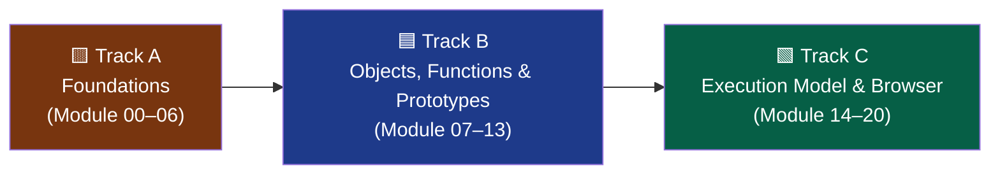

---

## 📑 Contents

<table>
<tr>
<td valign="top" width="33%">

**🟨 Track A — Foundations**
- [Module 00 — Setup & Mental Model](#module-00--setup--mental-model)
- [Module 01 — Data Types & Variables](#module-01--data-types--variables)
- [Module 02 — Operators & Type Coercion](#module-02--operators--type-coercion)
- [Module 03 — Control Flow](#module-03--control-flow)
- [Module 04 — Functions Basics](#module-04--functions-basics)
- [Module 05 — Scope & Hoisting](#module-05--scope--hoisting)
- [Module 06 — Closures](#module-06--closures)

</td>
<td valign="top" width="33%">

**🟦 Track B — Objects, Functions & Prototypes**
- [Module 07 — Objects](#module-07--objects)
- [Module 08 — Arrays](#module-08--arrays)
- [Module 09 — the `this` Keyword](#module-09--the-this-keyword)
- [Module 10 — Prototypes & Inheritance](#module-10--prototypes--inheritance)
- [Module 11 — Functions as First-Class Citizens](#module-11--functions-as-first-class-citizens)
- [Module 12 — Higher-Order Functions & Callbacks](#module-12--higher-order-functions--callbacks)
- [Module 13 — IIFE & Module Pattern](#module-13--iife--module-pattern)

</td>
<td valign="top" width="33%">

**🟩 Track C — Execution Model & Browser**
- [Module 14 — Execution Context & Call Stack](#module-14--execution-context--call-stack)
- [Module 15 — Event Loop & Concurrency](#module-15--event-loop--concurrency)
- [Module 16 — DOM Manipulation Basics](#module-16--dom-manipulation-basics)
- [Module 17 — Events & Event Delegation](#module-17--events--event-delegation)
- [Module 18 — JSON & Data Handling](#module-18--json--data-handling)
- [Module 19 — Error Handling & Debugging](#module-19--error-handling--debugging)
- [Module 20 — Build Track](#module-20--project-build-track)

</td>
</tr>
</table>

---

## ⚠️ আগে জেনে নাও — কেন "Core JavaScript" আলাদা করে শেখা জরুরি

| ভুল ধারণা | বাস্তবতা |
|---|---|
| "React/Vue শিখলেই যথেষ্ট" | Framework আসলে plain JavaScript-এর উপরেই দাঁড়িয়ে — মূল ভিত্তি দুর্বল হলে debug করা কঠিন হয়ে যায় |
| "Syntax জানলেই JS জানা হয়ে গেল" | `this`, closure, prototype, event loop না বুঝলে অনেক bug-এর "কেন" কখনোই বোঝা যায় না |
| "সব ভাষা একইভাবে কাজ করে" | JavaScript-এর single-threaded + asynchronous মডেল, prototype-based object system — এগুলো অনন্য এবং আলাদাভাবে বোঝা দরকার |
| "Hoisting মানে কিছুই না" | Hoisting না বুঝলে `var`-এর অদ্ভুত আচরণ, TDZ error confusing লাগবে |

### 🧠 Analogy
> **Syntax শেখা** = গাড়ি চালানো শেখা (steering, gear, brake)। **Core JavaScript বোঝা** = গাড়ির ইঞ্জিন কীভাবে কাজ করে তা জানা — রাস্তায় সমস্যা হলে শুধু প্রথমটা জানলে আটকে যাবে, দ্বিতীয়টা জানলে সমাধান করতে পারবে।

---

## Module 00 — Setup & Mental Model

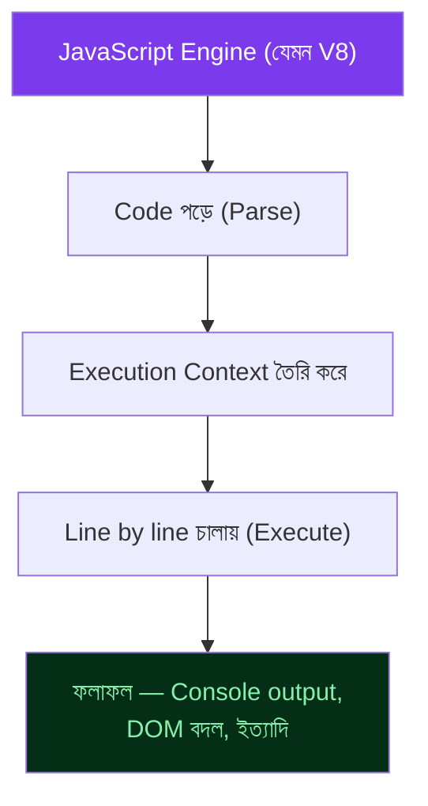

### Environment Setup

```bash
node -v                     # Node.js version চেক

# Browser-এ চালাতে — যেকোনো .html ফাইলে
```

```html
<!-- index.html -->
<script>
  console.log("হ্যালো, JavaScript!");
</script>
```

```bash
# অথবা Node.js দিয়ে
node script.js
```

> 💡 JavaScript প্রথমে ব্রাউজারের জন্য বানানো হয়েছিল (ওয়েবপেজ interactive করতে), পরে Node.js দিয়ে server-side-এও চলা শুরু করে। দুটো পরিবেশেই **ভাষার মূল নিয়ম একই**, শুধু `window`/`document`-এর মতো কিছু API শুধু browser-এ থাকে, আর `fs`/`process`-এর মতো কিছু শুধু Node.js-এ।

---

## Module 01 — Data Types & Variables

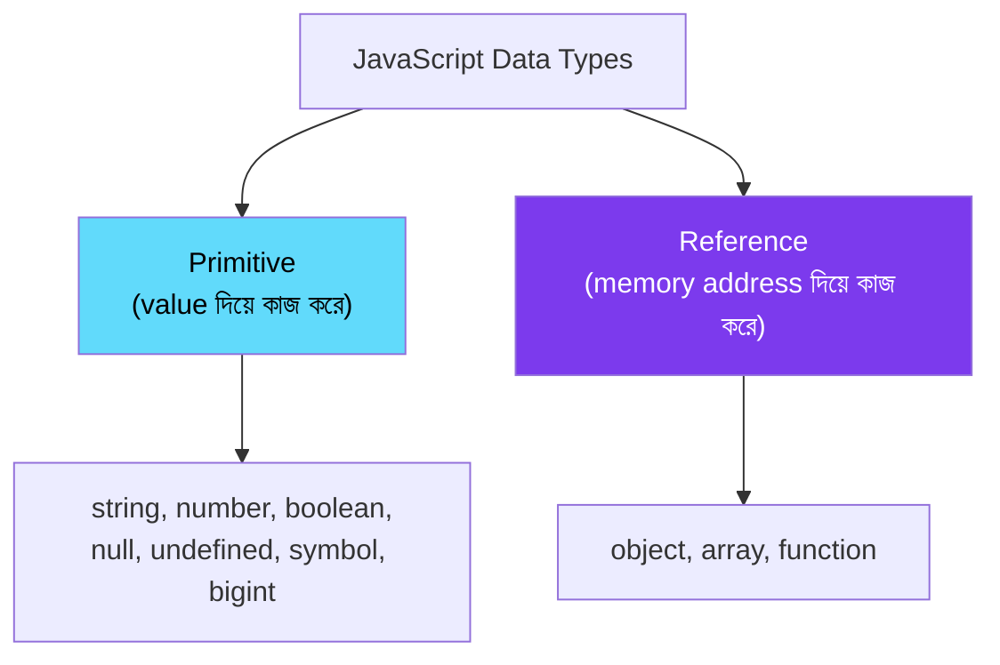

```js
// Primitive types
let name = "Rafi";              // string
let age = 25;                     // number
let isStudent = true;             // boolean
let notAssigned;                   // undefined — declare করা হয়েছে, value নেই
let empty = null;                   // null — ইচ্ছাকৃতভাবে "কিছু নেই"
let bigNumber = 9007199254740993n;    // bigint — খুব বড় সংখ্যার জন্য

// Reference types
let user = { name: "Tumpa", age: 22 };   // object
let numbers = [1, 2, 3];                    // array (আসলে বিশেষ ধরনের object)

// typeof দিয়ে data type চেক করা
console.log(typeof name);       // "string"
console.log(typeof age);         // "number"
console.log(typeof user);        // "object"
console.log(typeof null);         // "object" — এটা একটা পুরোনো bug, ঠিক করা হয়নি backward compatibility-এর জন্য
```

### Primitive vs Reference — কপি হওয়ার পার্থক্য

```js
// Primitive — copy by value
let a = 10;
let b = a;
b = 20;
console.log(a);   // 10 — a বদলায়নি

// Reference — copy by reference (memory address কপি হয়)
let obj1 = { value: 10 };
let obj2 = obj1;
obj2.value = 20;
console.log(obj1.value);   // 20 — obj1-ও বদলে গেছে! কারণ একই object-কে point করছে
```

> ❌ **Common mistake:** object/array copy করার সময় `let copy = original` লিখলে সেটা copy না, বরং একই memory location-এর দুটো নাম। প্রকৃত copy করতে spread operator (`{...obj}`) বা `Object.assign()` ব্যবহার করো।

---

## Module 02 — Operators & Type Coercion

```js
// Arithmetic
console.log(10 + 5);    // 15
console.log(10 % 3);     // 1 — remainder (ভাগশেষ)
console.log(2 ** 3);      // 8 — exponent

// Comparison — এখানেই সবচেয়ে বেশি ভুল হয়
console.log(5 == "5");     // true  — শুধু value compare, type coerce করে
console.log(5 === "5");    // false — value ও type দুটোই compare করে

// Logical
console.log(true && false);   // false
console.log(true || false);     // true
console.log(!true);                // false

// Type Coercion — JavaScript নিজে থেকে type বদলে ফেলে
console.log("5" + 3);        // "53"  — number, string-এ convert হলো (concatenation)
console.log("5" - 3);         // 2     — string, number-এ convert হলো (subtraction)
console.log("5" * "2");       // 10    — দুটোই number-এ convert
console.log(1 + true);          // 2     — true → 1
console.log("" + null);          // "null"
console.log([] + []);             // ""    — array → string
```

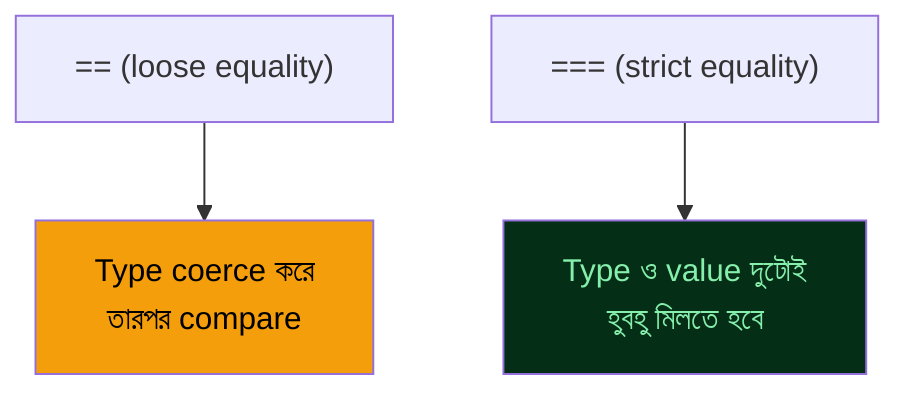

> ❌ **সবচেয়ে গুরুত্বপূর্ণ নিয়ম:** সবসময় `===` ও `!==` ব্যবহার করো, `==`/`!=` না। Loose equality-এর coercion rule জটিল ও অপ্রত্যাশিত (`[] == false` হলো `true`!) — এই ধরনের surprise এড়াতে strict equality-ই একমাত্র নিরাপদ পথ।

---

## Module 03 — Control Flow

```js
// if / else if / else
const score = 75;
if (score >= 80) {
  console.log("A গ্রেড");
} else if (score >= 60) {
  console.log("B গ্রেড");
} else {
  console.log("C গ্রেড");
}

// switch
const day = "রবিবার";
switch (day) {
  case "শুক্রবার":
  case "শনিবার":
    console.log("সাপ্তাহিক ছুটি");
    break;
  default:
    console.log("কর্মদিবস");
}

// Loops
for (let i = 0; i < 5; i++) {
  console.log(i);
}

let count = 0;
while (count < 3) {
  console.log(count);
  count++;
}

// Ternary — সংক্ষিপ্ত if-else
const status = score >= 60 ? "পাস" : "ফেল";
```

> ❌ `switch`-এ `break` ভুলে যাওয়া — একটা `case` match করলে পরের সবগুলো `case`-ও চলতে থাকবে ("fall-through"), যেটা প্রায়ই অনিচ্ছাকৃত bug।

---

## Module 04 — Functions Basics

```js
// Function declaration — hoisted হয়, define করার আগেও কল করা যায়
function greet(name) {
  return `হ্যালো, ${name}!`;
}

// Function expression — hoisted হয় না (variable-এর মতো আচরণ)
const add = function (a, b) {
  return a + b;
};

// Parameter vs Argument
function multiply(a, b) {   // a, b হলো parameter
  return a * b;
}
multiply(2, 3);                 // 2, 3 হলো argument

// Return না দিলে undefined ফেরত আসে
function noReturn() {
  console.log("কিছু একটা হচ্ছে");
}
console.log(noReturn());   // undefined
```

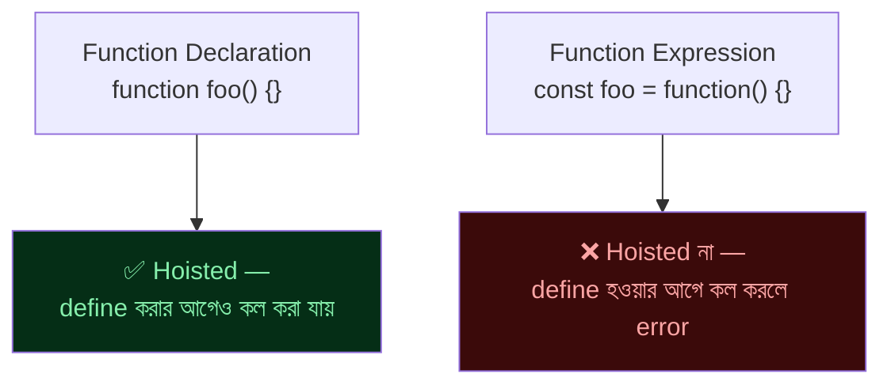

> ❌ Function expression-কে define হওয়ার আগে কল করা — `Cannot access 'add' before initialization` বা `TypeError: add is not a function` error দেবে। শুধু function declaration hoisted হয়ে "সম্পূর্ণভাবে" ব্যবহারযোগ্য হয়ে যায়।

---

## Module 05 — Scope & Hoisting

### Definition
Scope নির্ধারণ করে একটা variable কোথা থেকে **accessible** — আর Hoisting হলো JavaScript engine-এর সেই আচরণ যেখানে variable/function declaration কোড চলার আগেই memory-তে "উপরে তোলা" হয়।

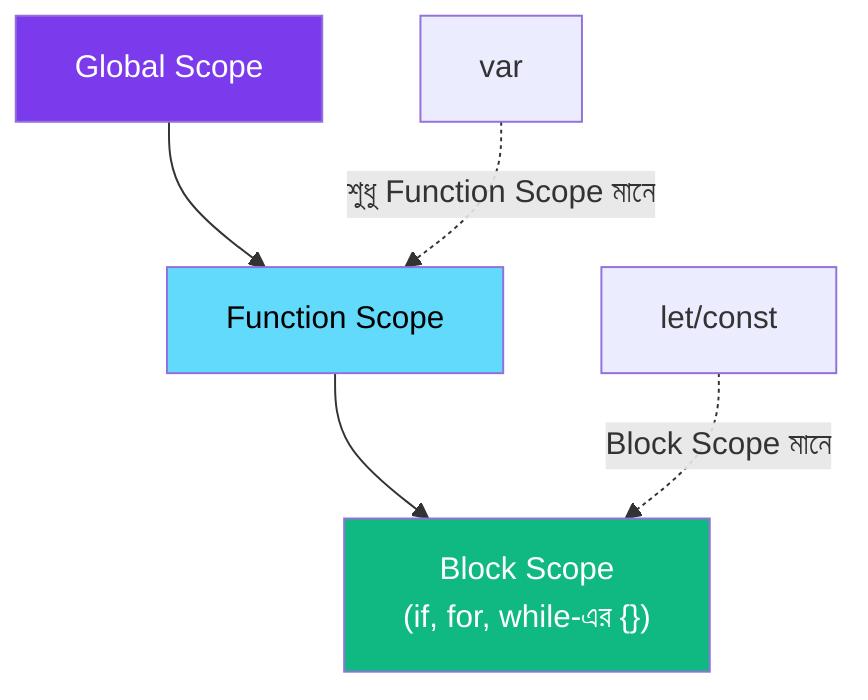

```js
console.log(x);   // undefined (error না!) — var hoisted হয়, কিন্তু value না
var x = 5;

// উপরের কোড আসলে engine এভাবে দেখে:
// var x;              ← hoisted (উপরে তোলা)
// console.log(x);     ← undefined
// x = 5;

function scopeDemo() {
  if (true) {
    var functionScoped = "আমি var";     // function-এর যেকোনো জায়গা থেকে accessible
    let blockScoped = "আমি let";          // শুধু এই {} ব্লকের ভেতরে accessible
  }
  console.log(functionScoped);   // ✅ কাজ করবে
  // console.log(blockScoped);   // ❌ ReferenceError
}

// Temporal Dead Zone (TDZ) — let/const declare হওয়ার আগে ব্যবহার করলে
console.log(y);   // ❌ ReferenceError: Cannot access 'y' before initialization
let y = 10;
```

> ❌ **Common mistake:** `var` hoisting-কে "কোনো সমস্যা নেই" ভাবা — loop-এর ভেতরে `var` দিয়ে counter রেখে setTimeout ব্যবহার করলে সব callback একই (শেষ) value পায়, কারণ `var` block-scoped না, function-scoped।
> ```js
> for (var i = 0; i < 3; i++) {
>   setTimeout(() => console.log(i), 100);   // 3, 3, 3 — সবগুলো একই i শেয়ার করছে
> }
> // let দিয়ে করলে প্রতি iteration-এ নতুন i তৈরি হয় → 0, 1, 2 (সঠিক)
> ```

---

## Module 06 — Closures

### Definition
Closure হলো একটা function-এর সেই ক্ষমতা, যেটা দিয়ে সে তার **বাইরের (enclosing) scope-এর variable মনে রাখতে পারে**, এমনকি বাইরের function শেষ হয়ে যাওয়ার পরও।

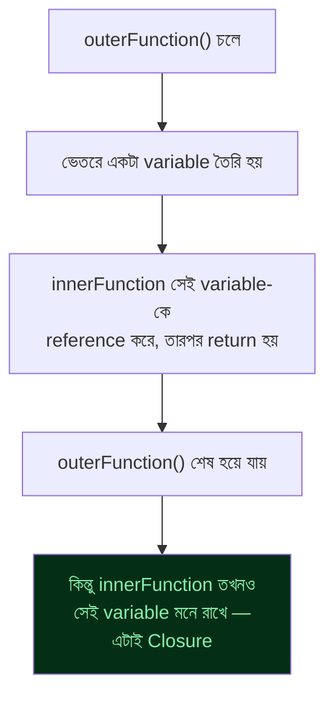

### 🎒 Analogy
> Closure হলো একটা ব্যাগপ্যাক — একটা function যখন তৈরি হয়, তখন সে তার আশেপাশের variable-গুলো নিজের "ব্যাগে" ভরে নিয়ে যায়। পরে যেখানেই সেই function কল হোক না কেন, ব্যাগের ভেতরের জিনিসগুলো তার কাছেই থাকে।

```js
function createCounter() {
  let count = 0;   // এই variable "মনে রাখা" হবে

  return function () {
    count++;
    return count;
  };
}

const counter = createCounter();
console.log(counter());   // 1
console.log(counter());   // 2
console.log(counter());   // 3 — count variable প্রতিবার মনে থাকছে

// প্রতিটা counter-এর নিজস্ব আলাদা closure থাকে
const counter2 = createCounter();
console.log(counter2());   // 1 — counter-এর থেকে সম্পূর্ণ আলাদা

// বাস্তব ব্যবহার — data privacy তৈরি করা
function createBankAccount(initialBalance) {
  let balance = initialBalance;   // বাইরে থেকে সরাসরি access করা যায় না

  return {
    deposit(amount) { balance += amount; },
    getBalance() { return balance; },
  };
}
const account = createBankAccount(1000);
account.deposit(500);
console.log(account.getBalance());   // 1500
console.log(account.balance);          // undefined — সরাসরি access নেই
```

> ❌ Loop-এর ভেতরে closure বানানোর সময় `var` ব্যবহার করলে সবগুলো closure একই variable share করে ফেলে (Module 05-এর উদাহরণ দেখো) — এটা closure সম্পর্কিত সবচেয়ে সাধারণ bug।

---

## Module 07 — Objects

```js
const user = {
  name: "Fahim",
  age: 28,
  greet: function () {
    return `আমি ${this.name}`;
  },
};

// Property access — dot ও bracket notation
console.log(user.name);          // "Fahim"
console.log(user["age"]);         // 28 — dynamic key হলে bracket লাগে

const key = "name";
console.log(user[key]);            // bracket notation দিয়ে variable ব্যবহার করা যায়

// Property যোগ/বদল/মোছা
user.city = "Dhaka";     // নতুন property
delete user.age;           // property মোছা

// Object.keys / values / entries
console.log(Object.keys(user));      // ["name", "greet", "city"]
console.log(Object.values(user));    // ["Fahim", function, "Dhaka"]
console.log(Object.entries(user));   // [["name", "Fahim"], ...]

// Property আছে কিনা check
console.log("name" in user);              // true
console.log(user.hasOwnProperty("age"));    // false — মুছে ফেলা হয়েছিল
```

> ❌ Object-এর key হিসেবে সরাসরি number বসানোর চেষ্টা — technically কাজ করে, কিন্তু key আসলে string-এ convert হয়ে যায় (`obj[1]` আসলে `obj["1"]`)।

---

## Module 08 — Arrays

```js
const fruits = ["আম", "কাঁঠাল", "লিচু"];

// Access ও পরিবর্তন
console.log(fruits[0]);        // "আম"
fruits[1] = "জাম";                // পরিবর্তন
fruits.push("কমলা");              // শেষে যোগ
fruits.pop();                      // শেষেরটা সরানো
fruits.unshift("বেল");              // শুরুতে যোগ
fruits.shift();                      // শুরুরটা সরানো

// গুরুত্বপূর্ণ পদ্ধতি
console.log(fruits.length);        // মোট সংখ্যা
console.log(fruits.indexOf("জাম"));   // index খুঁজে বের করা
console.log(fruits.includes("আম"));   // আছে কিনা check
console.log(fruits.slice(0, 2));       // অংশ কপি (মূল array বদলায় না)
console.log(fruits.join(", "));        // string বানানো

// Array কিনা check — typeof কাজ করবে না, কারণ array-ও "object" type
console.log(Array.isArray(fruits));   // true
console.log(typeof fruits);              // "object" — এটা ভুল ধারণা দিতে পারে
```

| Method | Mutate করে (মূল array বদলায়)? |
|---|---|
| `push()`, `pop()`, `shift()`, `unshift()`, `splice()` | ✅ হ্যাঁ |
| `slice()`, `concat()`, `join()`, `indexOf()` | ❌ না |

> ❌ `typeof array` দিয়ে array কিনা চেক করার চেষ্টা — সবসময় `"object"` দেখাবে। সঠিকভাবে চেক করতে `Array.isArray()` ব্যবহার করো।

---

## Module 09 — the `this` Keyword

### Definition
`this` হলো একটা function-এর ভেতরে সেই "context"-কে বোঝায় যেটা **কীভাবে function-টা কল করা হয়েছে তার উপর নির্ভর করে** — কোথায় define করা হয়েছে তার উপর না।

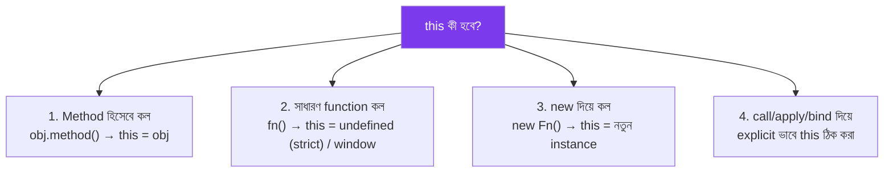

```js
const user = {
  name: "Nadia",
  greet() {
    console.log(`হাই, আমি ${this.name}`);   // this = user (method হিসেবে কল হয়েছে)
  },
};
user.greet();   // "হাই, আমি Nadia"

// this হারিয়ে যাওয়া — খুবই common bug
const greetFn = user.greet;
greetFn();       // "হাই, আমি undefined" — এখন this আর user না!

// call / apply / bind — this explicitly নির্ধারণ করা
function introduce() {
  console.log(`আমি ${this.name}`);
}
const person = { name: "Kabir" };
introduce.call(person);        // this = person (argument আলাদা করে)
introduce.apply(person);       // this = person (argument array আকারে)
const boundFn = introduce.bind(person);   // this স্থায়ীভাবে বেঁধে দেওয়া
boundFn();

// Regular function vs Arrow function-এর this
const timer = {
  seconds: 0,
  startBroken() {
    setInterval(function () {
      this.seconds++;   // ❌ this এখানে timer না, কারণ regular function নতুন this তৈরি করে
    }, 1000);
  },
  startFixed() {
    setInterval(() => {
      this.seconds++;   // ✅ arrow function বাইরের this (timer) ধরে রাখে
    }, 1000);
  },
};
```

> ❌ **সবচেয়ে বিভ্রান্তিকর ভুল:** `this` কোথায় **define** হয়েছে তার উপর নির্ভর করে ভাবা — আসলে এটা নির্ভর করে **কীভাবে call** হয়েছে তার উপর। একই function ভিন্নভাবে কল করলে `this`-ও ভিন্ন হয়ে যায়।

---

## Module 10 — Prototypes & Inheritance

### Definition
JavaScript-এর প্রতিটা object-এর একটা "লুকানো" link থাকে অন্য একটা object-এ — একে **prototype** বলে। কোনো property/method সরাসরি object-এ না পেলে, JavaScript prototype chain বেয়ে উপরে খুঁজতে থাকে।

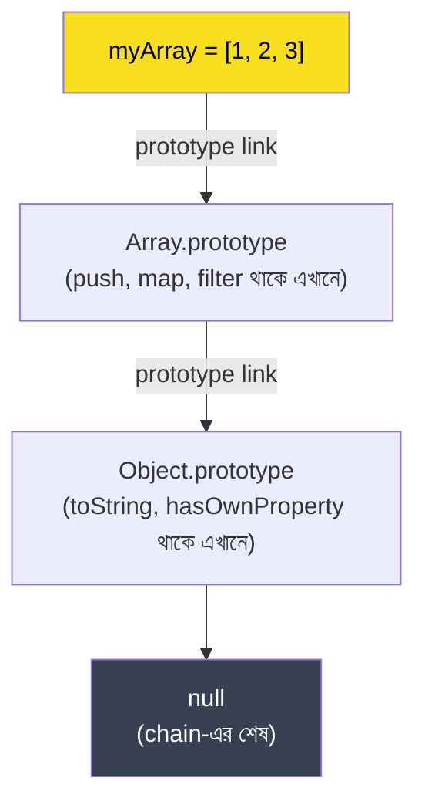

```js
// Constructor function দিয়ে prototype-based "class" (ES6 class-এর আগের পদ্ধতি)
function Animal(name) {
  this.name = name;
}
Animal.prototype.speak = function () {
  return `${this.name} শব্দ করছে`;
};

const dog = new Animal("টমি");
console.log(dog.speak());   // "টমি শব্দ করছে" — prototype থেকে method পাওয়া গেল

// Prototype chain নিজে যাচাই করা
console.log(dog.__proto__ === Animal.prototype);   // true
console.log(Object.getPrototypeOf(dog) === Animal.prototype);   // ✅ modern পদ্ধতি

// Prototype-based inheritance
function Dog(name, breed) {
  Animal.call(this, name);   // parent constructor কল করা
  this.breed = breed;
}
Dog.prototype = Object.create(Animal.prototype);   // prototype chain যুক্ত করা
Dog.prototype.constructor = Dog;

const myDog = new Dog("বাদল", "দেশি");
console.log(myDog.speak());   // parent method পাওয়া যাচ্ছে prototype chain দিয়ে
```

> 💡 আধুনিক `class` syntax (ES6+) আসলে এই prototype mechanism-এরই "syntactic sugar" — ভেতরে ঠিক এভাবেই কাজ করে। এই মূল ধারণা না বুঝে `class` ব্যবহার করলে অনেক আচরণ (যেমন method-এর মধ্যে `this`) রহস্যময় লাগবে।

> ❌ প্রতিটা object instance-এ আলাদা করে method define করা (memory waste) — prototype-এ একবার define করলে সব instance সেটা শেয়ার করে, আলাদা মেমোরি লাগে না।

---

## Module 11 — Functions as First-Class Citizens

### Definition
JavaScript-এ function-কে অন্য যেকোনো value (number, string)-এর মতোই ব্যবহার করা যায় — variable-এ রাখা, অন্য function-এ pass করা, অন্য function থেকে return করা।

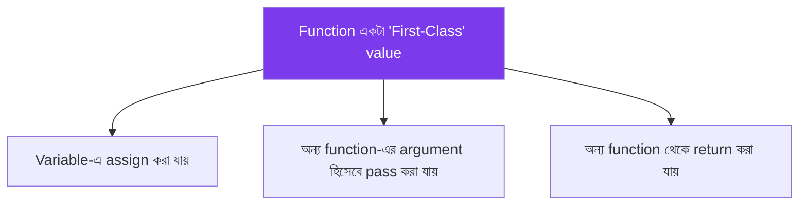

```js
// Variable-এ রাখা
const sayHi = function () {
  return "হাই!";
};

// Array-তে রাখা
const operations = [
  function (a, b) { return a + b; },
  function (a, b) { return a - b; },
];
console.log(operations[0](5, 3));   // 8

// অন্য function-এর argument হিসেবে pass করা
function executeOperation(a, b, operation) {
  return operation(a, b);
}
executeOperation(10, 5, function (x, y) { return x * y; });   // 50

// Function return করা
function createMultiplier(factor) {
  return function (num) {
    return num * factor;
  };
}
const double = createMultiplier(2);
console.log(double(5));   // 10
```

> 💡 এই "first-class function" ধারণাই callback, higher-order function, এবং পরে React-এর মতো library-তে component-কে function হিসেবে দেখার ভিত্তি।

---

## Module 12 — Higher-Order Functions & Callbacks

### Definition
Higher-order function হলো এমন function যেটা **অন্য function-কে argument হিসেবে নেয়**, বা **function return করে**। Callback হলো এমন একটা function যা পরে "call back" করার জন্য অন্য function-এ pass করা হয়।

```js
// Callback — asynchronous কাজের ফলাফল পরে জানানোর পদ্ধতি
function fetchData(callback) {
  setTimeout(() => {
    callback("ডেটা লোড হয়ে গেছে");
  }, 1000);
}
fetchData(function (result) {
  console.log(result);   // ১ সেকেন্ড পর দেখাবে
});

// Higher-order function — array method গুলোই সবচেয়ে সাধারণ উদাহরণ
const numbers = [1, 2, 3, 4, 5];
const doubled = numbers.map(function (n) { return n * 2; });
const evens = numbers.filter(function (n) { return n % 2 === 0; });
const total = numbers.reduce(function (sum, n) { return sum + n; }, 0);

// Callback Hell — অতিরিক্ত নেস্টেড callback (একটা পরিচিত সমস্যা)
getUser(1, function (user) {
  getPosts(user.id, function (posts) {
    getComments(posts[0].id, function (comments) {
      console.log(comments);   // ❌ পিরামিড আকৃতি, পড়া কঠিন হয়ে যাচ্ছে
    });
  });
});
// ES6+ এ Promise/async-await দিয়ে এই সমস্যার সমাধান হয় (আলাদা handbook-এ)
```

> ❌ **Common mistake:** callback-এর ভেতরে callback রেখে (nested callback) কোড ভয়াবহভাবে জটিল করে ফেলা — একে "Callback Hell" বলে। এই সমস্যা সমাধানের জন্যই ES6-এ Promise এসেছিল।

---

## Module 13 — IIFE & Module Pattern

### Definition
IIFE (Immediately Invoked Function Expression) হলো এমন একটা function যেটা define হওয়া মাত্রই নিজে থেকে চলে যায় — মূলত variable-কে global scope থেকে "লুকিয়ে" রাখতে ব্যবহৃত হয়।

```js
// IIFE syntax — () দিয়ে wrap করে সাথে সাথে () দিয়ে কল
(function () {
  const privateVar = "এটা বাইরে দেখা যাবে না";
  console.log("IIFE চলছে!");
})();

// Module Pattern — closure + IIFE দিয়ে private state তৈরি (ES6 module-এর আগের পদ্ধতি)
const CounterModule = (function () {
  let count = 0;   // সত্যিকারের private — বাইরে থেকে সরাসরি access নেই

  return {
    increment() { return ++count; },
    reset() { count = 0; },
  };
})();

console.log(CounterModule.increment());   // 1
console.log(CounterModule.increment());   // 2
console.log(CounterModule.count);           // undefined — সত্যিই private
```

> 💡 ES6 module system (`import`/`export`) আসার আগে, JavaScript-এ code-কে "private" রাখা ও namespace pollution এড়ানোর জন্য IIFE + Module Pattern-ই ছিল মূল কৌশল। আজকের কোডে ES module ব্যবহার হয়, কিন্তু পুরোনো codebase বোঝার জন্য এই pattern জানা জরুরি।

---

## Module 14 — Execution Context & Call Stack

### Definition
Execution Context হলো একটা "পরিবেশ" যেখানে JavaScript code চলে — এর ভেতরে variable, function, এবং `this`-এর মান নির্ধারিত থাকে। Call Stack হলো execution context-গুলোর একটা "স্তূপ" (stack), যেটা track করে এখন কোন function চলছে।

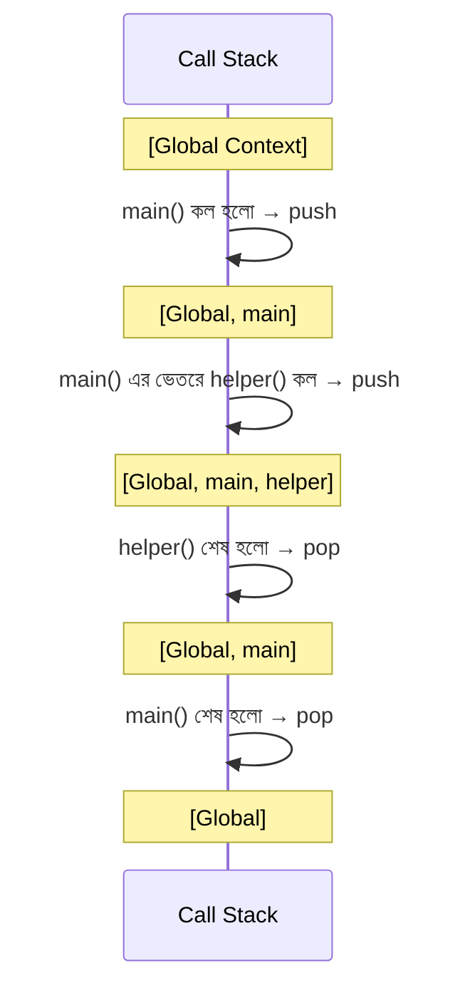

```js
function multiply(a, b) {
  return a * b;
}
function square(n) {
  return multiply(n, n);   // এখানে multiply() নতুন context হিসেবে stack-এ push হয়
}
function printSquare(n) {
  const result = square(n);
  console.log(result);
}
printSquare(5);
// Call stack ক্রম: printSquare → square → multiply → (একে একে সব pop হয়ে যায়)
```

> ❌ খুব বেশি recursive function কল করলে ("infinite recursion") Call Stack ভরে যায় — `Maximum call stack size exceeded` error আসে। এটা এড়াতে recursive function-এ সবসময় একটা স্পষ্ট "base case" (থামার শর্ত) থাকা দরকার।

---

## Module 15 — Event Loop & Concurrency

### Definition
JavaScript **single-threaded** — একসাথে একটাই কাজ করতে পারে। তবুও `setTimeout`, `fetch`-এর মতো asynchronous কাজ non-blocking মনে হয়, কারণ **Event Loop** নামের একটা মেকানিজম আছে যেটা Call Stack খালি হলে queue থেকে কাজ তুলে আনে।

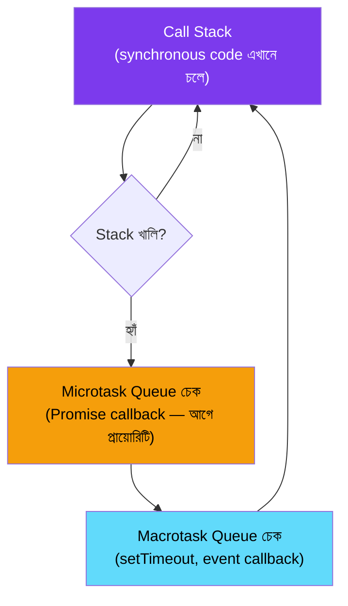

```js
console.log("১");

setTimeout(() => {
  console.log("২ (macrotask — setTimeout)");
}, 0);

Promise.resolve().then(() => {
  console.log("৩ (microtask — Promise)");
});

console.log("৪");

// আসল output ক্রম: ১, ৪, ৩, ২
// ব্যাখ্যা: synchronous code (১, ৪) সবার আগে চলে,
// তারপর microtask (Promise) macrotask (setTimeout)-এর আগে চলে
```

> 💡 **এই মডেল বোঝা সবচেয়ে গুরুত্বপূর্ণ:** `setTimeout(fn, 0)` দিলেও `fn` **সাথে সাথে** চলে না — Call Stack খালি হওয়া পর্যন্ত অপেক্ষা করে। এটাই ব্যাখ্যা করে কেন synchronous code সবসময় asynchronous code-এর আগে চলে, `setTimeout`-এর delay যতই কম হোক না কেন।

> ❌ **Common mistake:** ভাবা যে `setTimeout(fn, 1000)` মানে ঠিক ১ সেকেন্ড পরেই চলবে — আসলে এটা **নূন্যতম** delay, Call Stack ব্যস্ত থাকলে আরও দেরি হতে পারে।

---

## Module 16 — DOM Manipulation Basics

```js
// Element খুঁজে বের করা
const title = document.getElementById("title");
const buttons = document.querySelectorAll(".btn");
const firstButton = document.querySelector(".btn");

// Content বদলানো
title.textContent = "নতুন শিরোনাম";     // শুধু টেক্সট
title.innerHTML = "<b>বোল্ড টেক্সট</b>";   // HTML সহ (সাবধানে ব্যবহার করো — XSS ঝুঁকি)

// Style বদলানো
title.style.color = "blue";
title.classList.add("active");
title.classList.remove("hidden");
title.classList.toggle("dark-mode");

// নতুন element তৈরি ও যোগ করা
const newItem = document.createElement("li");
newItem.textContent = "নতুন আইটেম";
document.querySelector("ul").appendChild(newItem);

// Element মোছা
newItem.remove();
```

> ❌ `innerHTML`-এ সরাসরি user input বসানো — এটা **XSS (Cross-Site Scripting)** আক্রমণের একটা সাধারণ দরজা। User-generated content দেখাতে `textContent` ব্যবহার করো, বা content sanitize করো।

---

## Module 17 — Events & Event Delegation

```js
// Event listener যোগ করা
const button = document.querySelector("#submit-btn");
button.addEventListener("click", function (event) {
  console.log("ক্লিক হয়েছে!");
  console.log(event.target);   // যেই element-এ ক্লিক হয়েছে
});

// preventDefault — default browser আচরণ বন্ধ করা
document.querySelector("form").addEventListener("submit", function (event) {
  event.preventDefault();   // পেজ reload বন্ধ
});
```

### Event Delegation — একটা শক্তিশালী কৌশল

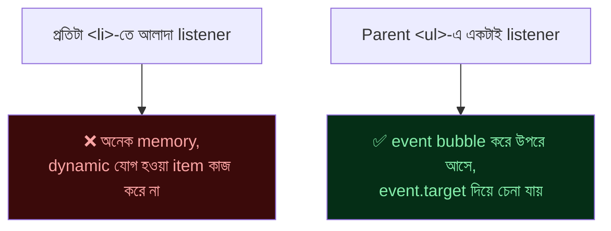

```js
// ❌ প্রতিটা আইটেমে আলাদা listener — নতুন item যোগ হলে কাজ করবে না
document.querySelectorAll("li").forEach((li) => {
  li.addEventListener("click", () => console.log("ক্লিক!"));
});

// ✅ Event delegation — parent-এ একটাই listener, ভবিষ্যতের item-এও কাজ করে
document.querySelector("ul").addEventListener("click", function (event) {
  if (event.target.tagName === "LI") {
    console.log(`ক্লিক হয়েছে: ${event.target.textContent}`);
  }
});
```

> 💡 Event delegation event bubbling নীতির উপর দাঁড়িয়ে — child element-এ event ঘটলে সেটা parent পর্যন্ত "বুদবুদের মতো" উঠে আসে। এটা ব্যবহার করলে dynamically যোগ হওয়া element-এও আলাদা করে listener লাগানো লাগে না।

---

## Module 18 — JSON & Data Handling

```js
// JavaScript Object → JSON string (সার্ভারে পাঠানোর জন্য, localStorage-এ রাখার জন্য)
const user = { name: "Sadia", age: 26, active: true };
const jsonString = JSON.stringify(user);
console.log(jsonString);   // '{"name":"Sadia","age":26,"active":true}'

// JSON string → JavaScript Object (সার্ভার থেকে data পাওয়ার পর)
const parsedUser = JSON.parse(jsonString);
console.log(parsedUser.name);   // "Sadia"

// বাস্তব ব্যবহার — localStorage-এ object রাখা
localStorage.setItem("user", JSON.stringify(user));
const savedUser = JSON.parse(localStorage.getItem("user"));

// pretty print — readable format
console.log(JSON.stringify(user, null, 2));
```

> ❌ `localStorage`-এ সরাসরি object রাখার চেষ্টা — `localStorage.setItem("user", user)` করলে `"[object Object]"` string হিসেবে save হয়ে যায়, আসল data হারিয়ে যায়। সবসময় `JSON.stringify()` দিয়ে save করো, `JSON.parse()` দিয়ে ফিরিয়ে আনো।

---

## Module 19 — Error Handling & Debugging

```js
// try / catch / finally
function divide(a, b) {
  try {
    if (b === 0) {
      throw new Error("শূন্য দিয়ে ভাগ করা যায় না");
    }
    return a / b;
  } catch (error) {
    console.error("সমস্যা হয়েছে:", error.message);
    return null;
  } finally {
    console.log("চেষ্টা শেষ হলো");
  }
}

// Custom Error তৈরি
class InsufficientFundsError extends Error {
  constructor(message) {
    super(message);
    this.name = "InsufficientFundsError";
  }
}

function withdraw(balance, amount) {
  if (amount > balance) {
    throw new InsufficientFundsError("পর্যাপ্ত ব্যালেন্স নেই");
  }
  return balance - amount;
}

// Debugging টুলস
console.log("সাধারণ তথ্য");
console.warn("সতর্কতা");
console.error("ত্রুটি");
console.table([{ name: "A" }, { name: "B" }]);   // table আকারে দেখানো
debugger;   // browser DevTools-এ breakpoint তৈরি করে
```

> 💡 `console.log` ছড়িয়ে ছড়িয়ে debug করার বদলে, browser DevTools-এর **breakpoint** ও **`debugger` statement** ব্যবহার করলে code-এর প্রতিটা ধাপে variable-এর মান দেখে দেখে debug করা যায় — অনেক বেশি কার্যকর।

---

## Module 20 — Project Build Track

### 🚀 ক্রম মেনে এগোও

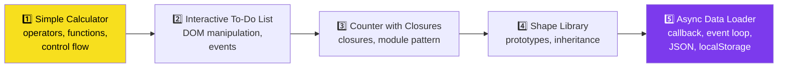

| Project | মূল দক্ষতা |
|---|---|
| **Simple Calculator** | Operators, function basics, control flow, type coercion সাবধানতা |
| **Interactive To-Do List** | DOM manipulation, event listener, event delegation |
| **Counter with Closures** | Closures, module pattern, private state |
| **Shape Library** | Prototype, constructor function, inheritance chain |
| **Async Data Loader** | Callback, event loop বোঝা, JSON parse/stringify, localStorage |

### 🔄 একটা সাধারণ প্রবাহ (Interactive To-Do List উদাহরণ)

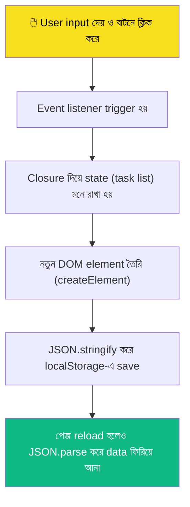

---

## ✅ Core JavaScript-Ready Checklist

- [ ] Primitive ও reference type-এর copy আচরণের পার্থক্য বুঝি
- [ ] `==` ও `===`-এর পার্থক্য এবং কেন `===` ব্যবহার করা উচিত জানি
- [ ] `var`/`let`/`const`-এর scope ও hoisting আচরণ ব্যাখ্যা করতে পারি
- [ ] Closure কী এবং কীভাবে data privacy তৈরি করে বুঝি
- [ ] `this`-এর মান কীভাবে নির্ধারিত হয় (call-site অনুযায়ী) জানি
- [ ] Prototype chain ও inheritance কীভাবে কাজ করে বুঝি
- [ ] Call Stack ও Event Loop-এর basic মডেল ব্যাখ্যা করতে পারি
- [ ] DOM manipulation ও event delegation করতে পারি
- [ ] JSON দিয়ে data serialize/deserialize করতে পারি
- [ ] `try/catch` দিয়ে error handle করতে পারি

> দশটার মধ্যে ৮টা ✅ হলে তুমি core JavaScript-এ ready!

---

## 📚 Reference Links

<div align="center">

[](https://developer.mozilla.org/en-US/docs/Web/JavaScript)
[](https://javascript.info)
[](https://github.com/getify/You-Dont-Know-JS)
[](https://www.jsv9000.app)
[](https://nodejs.org/docs/latest/api/)

</div>

| বিষয় | লিংক |
|---|---|
| MDN JavaScript Guide | https://developer.mozilla.org/en-US/docs/Web/JavaScript/Guide |
| JavaScript.info (সম্পূর্ণ ফ্রি টিউটোরিয়াল) | https://javascript.info |
| You Don't Know JS (গভীর ব্যাখ্যা, ফ্রি বই) | https://github.com/getify/You-Dont-Know-JS |
| JS Visualizer (call stack/event loop visualize) | https://www.jsv9000.app |
| Loupe (event loop visual টুল) | http://latentflip.com/loupe/ |

---

<div align="center">

### 💡 *"Framework শেখার আগে ইঞ্জিন বোঝো — বাকি সব তখন সহজ হয়ে যাবে।"*

⭐ কাজে লাগলে repo-টা star দাও!

<sub>Version note: JavaScript-এর মূল ভাষাগত (core language) মেকানিজম অনুযায়ী লেখা — এগুলো বছরের পর বছর স্থিতিশীল থাকে। নতুন সিনট্যাক্স (ES6+) ফিচারের জন্য "JS ES6+ Handbook" দেখো।</sub>


</div>
